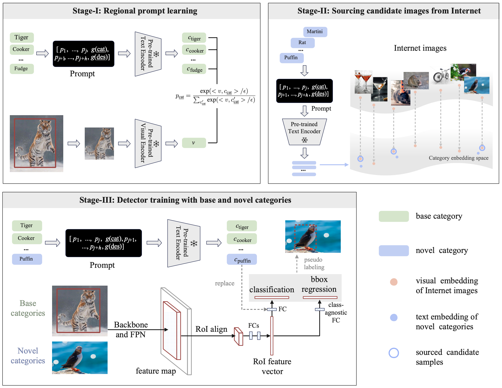

# PromptDet: Expand Your Detector  Vocabulary with Uncurated Images
[Paper](https://arxiv.org/abs/2203.16513) &nbsp; &nbsp; [Website](https://fcjian.github.io/promptdet)

## Introduction

The goal of this work is to establish a scalable pipeline for expanding an object detector towards novel/unseen categories, using *zero manual annotations*. To achieve that, we make the following four contributions: (i) in pursuit of generalisation, we propose a two-stage open-vocabulary object detector that categorises each box proposal by a classifier generated from the text encoder of a pre-trained visual-language model; (ii) To pair the visual latent space (from RPN box proposal) with that of the pre-trained text encoder, we propose the idea of *regional prompt learning* to optimise a couple of learnable prompt vectors, converting the textual embedding space to fit those visually object-centric images; (iii) To scale up the learning procedure towards detecting a wider spectrum of objects, we exploit the available online resource, iteratively updating the prompts, and later self-training the proposed detector with pseudo labels generated on a large corpus of noisy, uncurated web images. The self-trained detector, termed as **PromptDet**, significantly improves the detection performance on categories for which manual annotations are unavailable or hard to obtain, *e.g.* rare categories. Finally, (iv) to validate the necessity of our proposed components, we conduct extensive experiments on the challenging LVIS and MS-COCO dataset, showing superior performance over existing approaches with *fewer additional training images* and *zero manual annotations* whatsoever.

## Training framework


## Prerequisites

- MMDetection version 2.16.0.

- Please see [get_started.md](docs/get_started.md) for installation and the basic usage of MMDetection.

## Inference

```python
# assume that you are under the root directory of this project,
# and you have activated your virtual environment if needed.
# and with LVIS v1.0 dataset in 'data/lvis_v1'.

./tools/dist_test.sh configs/promptdet/promptdet_mask_rcnn_r50_fpn_sample1e-3_mstrain_1x_lvis_v1.py work_dirs/promptdet_mask_rcnn_r50_fpn_sample1e-3_mstrain_1x_lvis_v1.pth 4 --eval bbox segm
```

## Train
```python
# first download 'lvis_v1_train_seen.json' to 'data/lvis_v1/annotations'.

# train detector without self-training
./tools/dist_test.sh configs/promptdet/promptdet_mask_rcnn_r50_fpn_sample1e-3_mstrain_1x_lvis_v1.py work_dirs/promptdet_mask_rcnn_r50_fpn_sample1e-3_mstrain_1x_lvis_v1.pth 4 --eval bbox segm

# train detector with self-training
# To be updated.
```
[0] *Annotation file of base categories: [lvis_v1_train_seen.json](https://drive.google.com/file/d/1dZQ5ytHgJPv4VgYOyjJerq4adc6GQkkd/view?usp=sharing).*

## Models

For your convenience, we provide the following trained models (PromptDet) with mask AP.

Model | Epochs | Scale Jitter | Input Size | AP<sub>novel | AP<c>c | AP<sub>f | AP | Download
--- |:---:|:---:|:---:|:---:|:---:|:---:|:---:|:---:
PromptDet_R_50_FPN_1x | 12 | 640~800  | 800x800 | 19.0 | 18.5 | 25.8 | 21.4 | [google](https://drive.google.com/file/d/1JIl7om8BJGQSUtjlOgBvOBc7QXWiYSgM/view?usp=sharing) / [baidu]()
PromptDet_R_50_FPN_6x | 72 | 100~1280 | 800x800 | 21.4 | 23.3 | 29.3 | 25.3 | [google](https://drive.google.com/file/d/19v9zqAdfYA2qZcF6zbKlWvDRQCtOtlGt/view?usp=sharing) / [baidu]()

[0] *All results are obtained with a single model and without any test time data augmentation such as multi-scale, flipping and etc..* \
[1] *Refer to more details in config files in `config/promptdet/`.* \
[2] *Extraction code of baidu netdisk: promptdet.*


## Acknowledgement

Thanks MMDetection team for the wonderful open source project!


## Citation

If you find PromptDet useful in your research, please consider citing:

```
@inproceedings{feng2022promptdet,
    title={PromptDet: Expand Your Detector Vocabulary with Uncurated Images},
    author={Feng, Chengjian and Zhong, Yujie and Jie, Zequn and Chu, Xiangxiang and Ren, Haibing and Wei, Xiaolin and Xie, Weidi and Ma, Lin},
    journal={arXiv preprint arXiv:2203.16513},
    year={2022}
}
```


